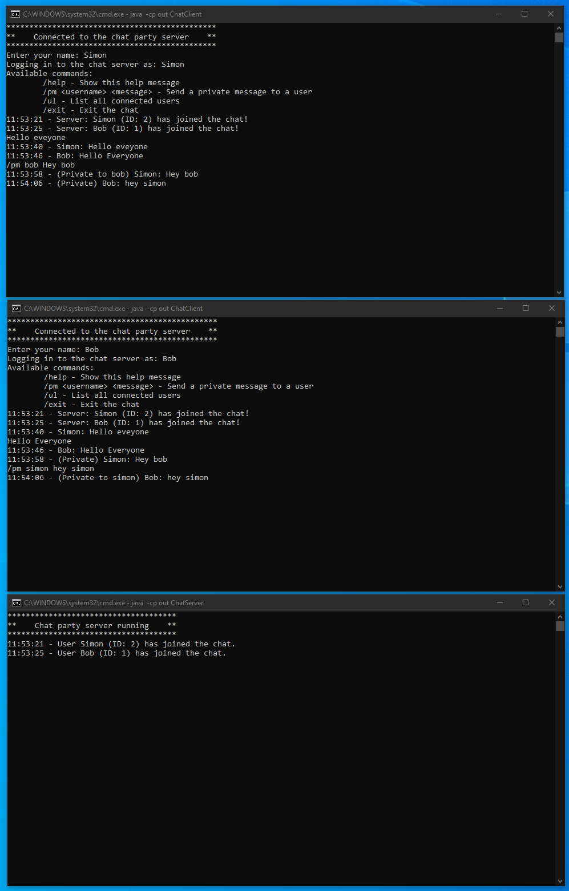

# Readme for Chat Application

Author: [Simon Stirling](https://bestdev.co.il)

## Overview

This online chat application allows multiple users to connect to a central server, send messages, and receive messages from other users. The application is implemented in Java using socket programming and features a simple text-based user interface.

## Features

- Multiple clients can connect to the server.
- Clients can send messages to the server, which will broadcast them to all connected clients.
- Clients can send private messages to specific users.
- Clients can list all connected users.
- Unique user ID assignment for each connected client.
- Commands for user interaction.

## Commands

- `/help`: Show the help message with available commands.
- `/pm <username> <message>`: Send a private message to a user.
- `/ul`: List all connected users.
- `/exit`: Exit the chat.

## Project Structure

```plaintext
ProjectRoot
│   run.bat
|   readme.md
└───src
    ├───ChatServer.java
    └───ChatClient.java
```

## How to Use

1. **Download and Extract the Project:**
   Download and extract the project files to your local machine.

2. **Compile the Java Files:**
   The provided batch file (`run.bat`) will handle the compilation for you.

3. **Run the Batch File:**
   Double-click the `run.bat` file to start the server and two client instances.

### run.bat File Content

The `run.bat` file will compile the Java source files and start the server and two clients.

```batch
@echo off
echo Compiling Java files...
javac -d out src\ChatServer.java src\ChatClient.java

echo Starting Chat Server...
start cmd /k "java -cp out ChatServer"

timeout /t 2 /nobreak >nul

echo Starting Chat Client 1...
start cmd /k "java -cp out ChatClient"

timeout /t 2 /nobreak >nul

echo Starting Chat Client 2...
start cmd /k "java -cp out ChatClient"

echo All processes started.
```

### Steps to Run the Application

1. **Ensure the Project Structure:**
   Make sure the project directory contains the `src` folder with the Java source files and the `run.bat` file in the root directory.

2. **Execute the Batch File:**

   - Navigate to the project root directory.
   - Double-click the `run.bat` file.
   - This will open three command prompt windows: one for the server and two for the clients.

3. **Interacting with the Application:**
   - In each client window, enter your username when prompted.
   - Use the available commands to interact with other users.

## Screenshots


